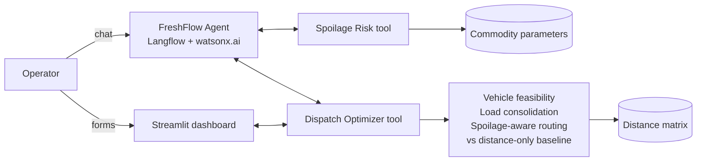

# Architecture

Rendered slide version: `architecture.svg` (and `architecture.png`).

- LLM = orchestration and explanation.
- Python = all calculations (risk scoring, feasibility, consolidation, routing).
- The dashboard calls the Python optimizer directly; the agent is a separate chat interface to the same tools.